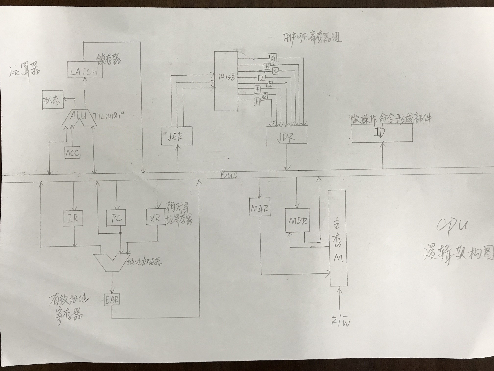

[TOC]

@author 薛轲翰

@学号 2017303171

# 指令系统设计

由于指令的操作数与寻址方式不同, 根据作业中所要求实现的指令类型, 以以下思路设计指令系统.

## 分析寻址类型需求

1. 由于存在$8=2^3$种不同操作指令, 所以可以用3bit的操作码来区分该8种不同操作指令

   | mov  | add  | sub  | and  | or   | not  | jmp  | hlt  |
   | ---- | ---- | ---- | ---- | ---- | ---- | ---- | ---- |
   | 000  | 001  | 010  | 011  | 100  | 101  | 110  | 111  |

   其中mov, add, sub, and, or为双操作数指令, not和jmp为单操作数指令, hlt为零操作数指令

2. 所有指令的两个操作数不能同时为内存操作数. 该CPU需支持立即寻址, 直接寻址, 寄存器直接寻址和相对寻址.

   其中有以下约束:

   - 目的操作数不能为立即寻址方式
   - 相对寻址一般用于转移指令, 所以本大作业设计中不在其他类型指令中出现
   - 指令字长为单字节或双字节

   设定每一条指令的左操作数为目的操作数, 右操作数为源操作数.

   为了区分不同的寻址方式, 需要在操作数前面加上寻址特征. 

   本题目中双操作数指令的寻址方式均有4种, 设定寻址特征如下:

   | 寻址方式 | 寄存器直接寻址-立即数寻址 | 寄存器直接寻址-寄存器直接寻址 | 寄存器直接寻址-直接寻址 | 直接寻址-寄存器直接寻址 |
   | -------- | ------------------------- | ----------------------------- | ----------------------- | ----------------------- |
   | 寻址特征 | 00                        | 01                            | 10                      | 11                      |

   单操作数not指令的寻址方式有两种, 直接寻址与寄存器直接寻址. not为单操作数指令, 操作数可以为直接寻址与寄存器直接寻址两种方式. 因为指令的位数够用, 为了保持指令格式的整齐, 仍采用2位的寻址特征. 

   | 寻址方式 | 寄存器直接寻址 | 直接寻址 |
   | -------- | -------------- | -------- |
   | 寻址特征 | 00             | 01       |

   单操作数jmp指令是转移类指令, 有相对偏移与绝对偏移两种方式. 相对偏移的方式即为相对寻址, 跳转后的地址为PC当前值+jmp指令的操作数. 绝对偏移即为立即寻址, 直接跳转到jmp指令的操作数代表的地址.

   | 寻址方式 | 相对寻址 | 立即寻址 |
| -------- | -------- | -------- |
   | 寻址特征 | 00       | 01       |
   
   确定各种指令中不同操作数的长度:
   
      - 立即数寻址取决于剩下的指令位数
      -  $8=2^3$个程序员可见寄存器, 寄存器寻址操作数长度为3
      - $2^8$字节的地址空间, 直接寻址操作数的长度为8

## 设计指令系统

### ***mov***

分为以下几种情况:

**movRI**

| 操作码 | 寻址特征 | 左操作数:寄存器编号(3位) | 右操作数:立即数(8位) |
| ------ | -------- | ------------------------ | -------------------- |
| 000    | 00       | xxx                      | xxxxxxxx             |

**movRR**

| 操作码 | 寻址特征 | 空码  | 左操作数:寄存器编号(3位) | 右操作数:寄存器编号(3位) |
| ------ | -------- | ----- | ------------------------ | ------------------------ |
| 000    | 01       | 00000 | xxx                      | xxx                      |

**movRM**

| 操作码 | 寻址特征 | 左操作数:寄存器编号(3位) | 右操作数:主存地址编号(8位) |
| ------ | -------- | ------------------------ | -------------------------- |
| 000    | 10       | xxx                      | xxxxxxxx                   |

**movMR**

| 操作码 | 寻址特征 | 左操作数:主存地址编号(8位) | 右操作数:寄存器编号(3位) |
| ------ | -------- | -------------------------- | ------------------------ |
| 000    | 11       | xxxxxxxx                   | xxx                      |

### ***add***

同mov, 分为以下几种情况:

**addRI**

| 操作码 | 寻址特征 | 左操作数:寄存器编号(3位) | 右操作数:立即数(8位) |
| ------ | -------- | ------------------------ | -------------------- |
| 001    | 00       | xxx                      | xxxxxxxx             |

**addRR**

| 操作码 | 寻址特征 | 空码  | 左操作数:寄存器编号(3位) | 右操作数:寄存器编号(3位) |
| ------ | -------- | ----- | ------------------------ | ------------------------ |
| 001    | 01       | 00000 | xxx                      | xxx                      |

**addRM**

| 操作码 | 寻址特征 | 左操作数:寄存器编号(3位) | 右操作数:主存地址编号(8位) |
| ------ | -------- | ------------------------ | -------------------------- |
| 001    | 10       | xxx                      | xxxxxxxx                   |

**addMR**

| 操作码 | 寻址特征 | 左操作数:主存地址编号(8位) | 右操作数:寄存器编号(3位) |
| ------ | -------- | -------------------------- | ------------------------ |
| 001    | 11       | xxxxxxxx                   | xxx                      |

### ***sub***

同mov, 分为以下几种情况:

**subRI**

| 操作码 | 寻址特征 | 左操作数:寄存器编号(3位) | 右操作数:立即数(8位) |
| ------ | -------- | ------------------------ | -------------------- |
| 010    | 00       | xxx                      | xxxxxxxx             |

**subRR**

| 操作码 | 寻址特征 | 空码  | 左操作数:寄存器编号(3位) | 右操作数:寄存器编号(3位) |
| ------ | -------- | ----- | ------------------------ | ------------------------ |
| 010    | 01       | 00000 | xxx                      | xxx                      |

**subRM**

| 操作码 | 寻址特征 | 左操作数:寄存器编号(3位) | 右操作数:主存地址编号(8位) |
| ------ | -------- | ------------------------ | -------------------------- |
| 010    | 10       | xxx                      | xxxxxxxx                   |

**subMR**

| 操作码 | 寻址特征 | 左操作数:主存地址编号(8位) | 右操作数:寄存器编号(3位) |
| ------ | -------- | -------------------------- | ------------------------ |
| 010    | 11       | xxxxxxxx                   | xxx                      |

### ***and***

同mov, 分为以下几种情况:

**andRI**

| 操作码 | 寻址特征 | 左操作数:寄存器编号(3位) | 右操作数:立即数(8位) |
| ------ | -------- | ------------------------ | -------------------- |
| 011    | 00       | xxx                      | xxxxxxxx             |

**andRR**

| 操作码 | 寻址特征 | 空码  | 左操作数:寄存器编号(3位) | 右操作数:寄存器编号(3位) |
| ------ | -------- | ----- | ------------------------ | ------------------------ |
| 011    | 01       | 00000 | xxx                      | xxx                      |

**andRM**

| 操作码 | 寻址特征 | 左操作数:寄存器编号(3位) | 右操作数:主存地址编号(8位) |
| ------ | -------- | ------------------------ | -------------------------- |
| 011    | 10       | xxx                      | xxxxxxxx                   |

**andMR**

| 操作码 | 寻址特征 | 左操作数:主存地址编号(8位) | 右操作数:寄存器编号(3位) |
| ------ | -------- | -------------------------- | ------------------------ |
| 011    | 11       | xxxxxxxx                   | xxx                      |

### ***or***

同mov, 分为以下几种情况:

**orRI**

| 操作码 | 寻址特征 | 左操作数:寄存器编号(3位) | 右操作数:立即数(8位) |
| ------ | -------- | ------------------------ | -------------------- |
| 100    | 00       | xxx                      | xxxxxxxx             |

**orRR**

| 操作码 | 寻址特征 | 空码  | 左操作数:寄存器编号(3位) | 右操作数:寄存器编号(3位) |
| ------ | -------- | ----- | ------------------------ | ------------------------ |
| 100    | 01       | 00000 | xxx                      | xxx                      |

**orRM**

| 操作码 | 寻址特征 | 左操作数:寄存器编号(3位) | 右操作数:主存地址编号(8位) |
| ------ | -------- | ------------------------ | -------------------------- |
| 100    | 10       | xxx                      | xxxxxxxx                   |

**orMR**

| 操作码 | 寻址特征 | 左操作数:主存地址编号(8位) | 右操作数:寄存器编号(3位) |
| ------ | -------- | -------------------------- | ------------------------ |
| 100    | 11       | xxxxxxxx                   | xxx                      |

### ***not***

**notR**

| 操作码 | 寻址特征 | 操作数:寄存器编号(3位) |
| ------ | -------- | ---------------------- |
| 101    | 00       | xxx                    |

**notM**

| 操作码 | 寻址特征 | 空码 | 操作数:主存地址编号(8位) |
| ------ | -------- | ---- | ------------------------ |
| 101    | 01       | xxx  | xxxxxxxx                 |

###  ***jmp***

**jmpR**

| 操作码 | 寻址特征 | 空码 | 操作数:主存地址编号(8位) |
| ------ | -------- | ---- | ------------------------ |
| 110    | 00       | 000  | xxxxxxxx                 |

**jmpD**

| 操作码 | 寻址特征 | 空码 | 操作数:主存地址编号(8位) |
| ------ | -------- | ---- | ------------------------ |
| 110    | 01       | 000  | xxxxxxxx                 |

### ***hlt***

无操作数

| 操作码 | 空码  |
| ------ | ----- |
| 111    | 00000 |

# CPU逻辑框图

# 基于硬布线方式的控制器设计

由于采用定长三级时序, 每个指令周期包含三个机器周期(取指周期, 间址周期和执行周期), 每个周期由三个节拍构成:

- 命名取指周期为FF, 间址周期命名为IND, 执行周期命名为EX
- 三个节拍分别命名为$T_0, T_1, T_2$

- I为间址标志. 若FF周期的$T_2$时刻测得I=1, 则IND触发器置"1", 标志进入间址周期. 若I=0, 则EX触发器置"1", 标志进入执行周期. 若在IND时期的$T_2$时刻测得IND=0, 则EX置"1", 表示进入执行周期, 表示只有一次间址; 若IND=1, 则表示多次间址, 继续进行间址寻址操作.

根据每一条指令的节拍安排, 总结出表(见附件DesignCPUHard.xls, 由于表格太大了, 文档里放不下)

化简得出以下微操作命令的表达式:

# 基于微程序方式的控制器设计

微程序，将一条机器指令编写成一个微程序，每个微程序包括若干条微指令，每一条微指令对应一个或几个微操作命令。然后把这些微程序存到一个控制寄存器中，用寻找用户程序机器指令的方法来寻找每个微程序中的微指令。
微程序设计省去了组合逻辑设计中队逻辑表达式的化简步骤，无需考虑逻辑门级数等，用规整的存储逻辑代替不规则的硬接线逻辑来实现计算机控制器的技术。

## 微指令格式设计

<table>
	<tr>
		<td style='text-align:center;'>2位</td>
		<td style='text-align:center;'>2位</td>
		<td style='text-align:center;'>5位</td>
		<td style='text-align:center;'>7位</td>
	</tr>
	<tr>
		<td colspan="3" style='text-align:center;'>控制操作字段</td>
		<td style='text-align:center;'>顺序操作字段</td>
	</tr>
</table>

微指令的操作字段采用字段直接编码方式，该字段发出各种控制信号。顺序控制字段仅在微程序的最后指向取值微程序，它可指出下条微指令的地址（简称下地址），以控制微指令序列的执行顺序。

前2位存放取值微程序相关的微操作

|  00  |   无操作    |
| :--: | :---------: |
|  01  |   PC->MAR   |
|  10  | M(MAR)->MDR |
|  11  |   MDR->IR   |

中间2位存放一些读、写信号的置有效和程序计算器等微操作

| 000  |   无操作   |
| :--: | :--------: |
| 001  |    1->R    |
| 010  | (PC)+1->PC |
| 011  |    1->W    |

中间5位存放转移、加减和取反等操作

|       |                   |
| :---: | :---------------: |
| 00000 |      无操作       |
| 00001 |     MDR->ACC      |
| 00010 |     JDR->ACC      |
| 00011 |    AD(IR)->MAR    |
| 00100 |    AD(IR)->JAR    |
| 00101 |    M(JAR)->JDR    |
| 00110 |    M(MAR)->MDR    |
| 00111 |    MDR->M(JAR)    |
| 01000 |    JDR->M(MAR)    |
| 01001 |    ACC->M(MAR)    |
| 01010 |    ACC->M(JAR)    |
| 01011 |   LATCH->M(MAR)   |
| 01100 |   LATCH->M(JAR)   |
| 01101 | MDR+(ACC)->LATCH  |
| 01110 | JDR+(ACC)->LATCH  |
| 01111 | MDR-(ACC)->LATCH  |
| 10000 | JDR-(ACC)->LATCH  |
| 10001 | MDR&(ACC)->LATCH  |
| 10010 | JDR&(ACC)->LATCH  |
| 10011 | MDR\|(ACC)->LATCH |
| 10100 | JDR\|(ACC)->LATCH |
| 10101 |   LATCH->M(MAR)   |
| 10110 |   LATCH->M(JAR)   |
| 10111 |   !(ACC)->LATCH   |
| 11000 | (PC)+AD(IR)->EAR  |
| 11001 |      EAR->PC      |
| 11010 |    AD(IR)->PC     |
| 11011 |       无效        |
| 11100 |       无效        |
| 11101 |       无效        |
| 11110 |       无效        |
| 11111 |       无效        |

## 微程序

|   PC->BUS->MAR,1->R    | M+1  |  M   |     取值周期微程序      |
| :--------------------: | :--: | :--: | :---------------------: |
| M(MAR)->MDR,(PC)+1->PC | M+2  |      |                         |
|      MDR->BUS->IR      | M+2  |      |                         |
|    OP(IR)->BUS->ID     | M+3  |      |                         |
|    AD(IR)->BUS->JAR    | A+1  |  A   |     movRI周期微程序     |
|  DA(IR)->BUS->M(JAR)   |  M   |      |                         |
|    AD(IR)->BUS->JAR    | B+1  |  B   |     movRR周期微程序     |
|      M(JAR)->JDR       | B+2  |      |                         |
|      AD(IR)->JAR       | B+3  |      |                         |
|      JDR->M(JAR)       |  M   |      |                         |
| AD(IR)->BUS->MAR，1->R | C+1  |  C   | movRM周期微程序  (间址) |
|      M(MAR)->MDR       | C+2  |      |        （间址）         |
|    AD(IR)->BUS->JAR    | C+3  |      |                         |
|      MDR->M(JAR)       |  M   |      |                         |
|    AD(IR)->BUS->JAR    | D+1  |  D   |     movMR周期微程序     |
|      M(JAR)->JDR       | D+2  |      |                         |
|    AD(IR)->BUS->MAR    | D+3  |      |                         |
|    M(MAR)->BUS->JDR    |  M   |      |                         |
|    DA(IR)->BUS->ACC    | E+1  |  E   |     addRI周期微程序     |
|    AD(IR)->BUS->JAR    | E+2  |      |                         |
|      M(JAR)->MDR       | E+3  |      |                         |
|    MDR+(ACC)->LATCH    | E+4  |      |                         |
|   LATCH->BUS->M(JAR)   |  M   |      |                         |
|    AD(IR)->BUS->JAR    | F+1  |  F   |     addRR周期微程序     |
|      M(JAR)->JDR       | F+2  |      |                         |
|     JDR->BUS->ACC      | F+3  |      |                         |
|    AD(IR)->BUS->JAR    | F+4  |      |                         |
|      M(JAR)->JDR       | F+5  |      |                         |
|    JDR+(ACC)->LATCH    | F+6  |      |                         |
|   LATCH->BUS->M(JAR)   |  M   |      |                         |
|    AD(IR)->BUS->MAR    | G+1  |  G   |  addRM周期微程序(间址)  |
|    M(MAR)->BUS->MDR    | G+2  |      |         （间址)         |
|     MDR->BUS->ACC      | G+3  |      |                         |
|    AD(IR)->BUS->JAR    | G+4  |      |                         |
|      M(JAR)->JDR       | G+5  |      |                         |
|    JDR+(ACC)->LATCH    | G+6  |      |                         |
|   LATCH->BUS->M(MAR)   |  M   |      |                         |
|    AD(IR)->BUS->JAR    | H+1  |  H   |     addMR周期微程序     |
|    AD(IR)->BUS->MAR    | H+2  |      |         (间址)          |
|      M(MAR)->MDR       | H+3  |      |         (间址)          |
|      M(JAR)->JDR       | H+4  |      |                         |
|     JDR->BUS->ACC      | H+5  |      |                         |
|    MDR+(ACC)->LATCH    | H+6  |      |                         |
|   LATCH->BUS->M(JAR)   |  M   |      |                         |
|    DA(IR)->BUS->ACC    | I+1  |  I   |     subRI周期微程序     |
|    AD(IR)->BUS->JAR    | I+2  |      |                         |
|      M(JAR)->MDR       | I+3  |      |                         |
|    MDR-(ACC)->LATCH    | I+4  |      |                         |
|   LATCH->BUS->M(JAR)   |  M   |      |                         |
|    AD(IR)->BUS->JAR    | J+1  |  J   |     subRR周期微程序     |
|      M(JAR)->JDR       | J+2  |      |                         |
|     JDR->BUS->ACC      | J+3  |      |                         |
|    AD(IR)->BUS->JAR    | J+4  |      |                         |
|      M(JAR)->JDR       | J+5  |      |                         |
|    JDR-(ACC)->LATCH    | J+6  |      |                         |
|   LATCH->BUS->M(JAR)   |  M   |      |                         |
|    AD(IR)->BUS->MAR    | K+1  |  K   |  subRM周期微程序(间址)  |
|    M(MAR)->BUS->MDR    | K+2  |      |         （间址)         |
|     MDR->BUS->ACC      | K+3  |      |                         |
|    ID(IR)->BUS->JAR    | K+4  |      |                         |
|      M(JAR)->JDR       | K+5  |      |                         |
|    JDR-(ACC)->LATCH    | K+6  |      |                         |
|   LATCH->BUS->M(MAR)   |  M   |      |                         |
|    AD(IR)->BUS->JAR    | L+1  |  L   |     subMR周期微程序     |
|      M(JAR)->JDR       | L+2  |      |                         |
|     JDR->BUS->ACC      | L+3  |      |                         |
|    AD(IR)->BUS->MAR    | L+4  |      |         (间址)          |
|      M(MAR)->MDR       | L+5  |      |         (间址)          |
|    MDR-(ACC)->LATCH    | L+6  |      |                         |
|     LATCH->M(JAR)      |  M   |      |                         |
|    DA(IR)->BUS->ACC    | N+1  |  N   |     andRI周期微程序     |
|    AD(IR)->BUS->JAR    | N+2  |      |                         |
|      M(JAR)->MDR       | N+3  |      |                         |
|    MDR&(ACC)->LATCH    | N+4  |      |                         |
|   LATCH->BUS->M(JAR)   |  M   |      |                         |
|    AD(IR)->BUS->JAR    | O+1  |  O   |     andRR周期微程序     |
|      M(JAR)->JDR       | O+2  |      |                         |
|     JDR->BUS->ACC      | O+3  |      |                         |
|    AD(IR)->BUS->JAR    | O+4  |      |                         |
|      M(JAR)->JDR       | O+5  |      |                         |
|    JDR&(ACC)->LATCH    | O+6  |      |                         |
|   LATCH->BUS->M(JAR)   |  M   |      |                         |
|    AD(IR)->BUS->MAR    | P+1  |  P   |  andRM周期微程序(间址)  |
|    M(MAR)->BUS->MDR    | P+2  |      |         （间址)         |
|     MDR->BUS->ACC      | P+3  |      |                         |
|    ID(IR)->BUS->JAR    | P+4  |      |                         |
|      M(JAR)->JDR       | P+5  |      |                         |
|    JDR&(ACC)->LATCH    | P+6  |      |                         |
|   LATCH->BUS->M(MAR)   |  M   |      |                         |
|    AD(IR)->BUS->JAR    | Q+1  |  Q   |     andMR周期微程序     |
|      M(JAR)->JDR       | Q+2  |      |                         |
|     JDR->BUS->ACC      | Q+3  |      |                         |
|    AD(IR)->BUS->MAR    | Q+4  |      |         (间址)          |
|      M(MAR)->MDR       | Q+5  |      |         (间址)          |
|    MDR&(ACC)->LATCH    | Q+6  |      |                         |
|     LATCH->M(JAR)      |  M   |      |                         |
|    DA(IR)->BUS->ACC    | R+1  |  R   |     orRI周期微程序      |
|    AD(IR)->BUS->JAR    | R+2  |      |                         |
|      M(JAR)->MDR       | R+3  |      |                         |
|   MDR\|(ACC)->LATCH    | R+4  |      |                         |
|   LATCH->BUS->M(JAR)   |  M   |      |                         |
|    AD(IR)->BUS->JAR    | S+1  |  S   |     orRR周期微程序      |
|      M(JAR)->JDR       | S+2  |      |                         |
|     JDR->BUS->ACC      | S+3  |      |                         |
|    AD(IR)->BUS->JAR    | S+4  |      |                         |
|      M(JAR)->JDR       | S+5  |      |                         |
|   JDR\|(ACC)->LATCH    | S+6  |      |                         |
|   LATCH->BUS->M(JAR)   |  M   |      |                         |
|    AD(IR)->BUS->MAR    | T+1  |  T   |  orRM周期微程序(间址)   |
|    M(MAR)->BUS->MDR    | T+2  |      |         （间址)         |
|     MDR->BUS->ACC      | T+3  |      |                         |
|    ID(IR)->BUS->JAR    | T+4  |      |                         |
|      M(JAR)->JDR       | T+5  |      |                         |
|   JDR\|(ACC)->LATCH    | T+6  |      |                         |
|   LATCH->BUS->M(MAR)   |  M   |      |                         |
|    AD(IR)->BUS->MAR    | U+1  |  U   |  orMR周期微程序(间址)   |
|      M(MAR)->MDR       | U+2  |      |         (间址)          |
|    AD(IR)->BUS->JAR    | U+3  |      |                         |
|      M(JAR)->JDR       | U+4  |      |                         |
|     JDR->BUS->ACC      | U+5  |      |                         |
|   MDR\|(ACC)->LATCH    | U+6  |      |                         |
|     LATCH->M(JAR)      |  M   |      |                         |
|    AD(IR)->BUS->JAR    | V+1  |  V   |     notR周期微程序      |
|      M(JAR)->JDR       | V+2  |      |                         |
|     JDR->BUS->ACC      | V+3  |      |                         |
|     !(ACC)->LATCH      | V+4  |      |                         |
|   LATCH->BUS->M(JAR)   |  M   |      |                         |
|    AD(IR)->BUS->MAR    | W+1  |  W   |  notM周期微程序(间址)   |
|      M(MAR)->MDR       | W+2  |      |        （间址）         |
|     MDR->BUS->ACC      | W+3  |      |                         |
|     !(ACC)->LATCH      | W+4  |      |                         |
|   LATCH->Bus->M(MAR)   |  M   |      |                         |
|    (PC)+AD(IR)->EAR    | X+1  |  X   |     jmpR周期微程序      |
|      EAR->BUS->PC      |  M   |      |                         |
|       AD(IR)->PC       |  M   |  Y   |                         |
|                        |  M   |  Z   |      htl周期微程序      |

